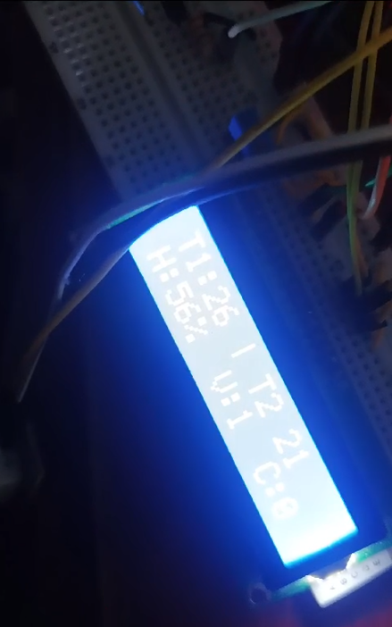
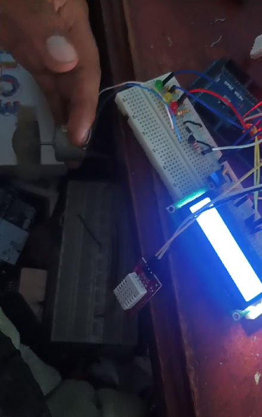

# Sistema de Ventilador Automatizado

Este proyecto implementa un sistema automatizado de ventilador y calefactor controlado por un sistema de inferencia difusa y sensores de temperatura y humedad. El sistema ajusta la velocidad del ventilador y la potencia del calefactor basándose en las lecturas de los sensores y las reglas de inferencia difusa.

## Componentes

- Arduino UNO
- Sensor de temperatura y humedad DHT22 (x2)
- Motor para ventilador
- Pantalla LCD 16x2
- LEDs indicadores de potencia del calefactor

## Requisitos

- [DHT sensor library](https://github.com/adafruit/DHT-sensor-library)
- [LiquidCrystal library](https://www.arduino.cc/en/Reference/LiquidCrystal)
- Plataforma Arduino IDE

## Configuración

### Conexiones de Hardware

- Sensor 1 (DHT22) - Pin 2
- Sensor 2 (DHT22) - Pin 10
- Motor del ventilador - Pin 3
- LEDs de potencia del calefactor:
  - LED bajo - Pin 11
  - LED medio - Pin 12
  - LED alto - Pin 13
- Pantalla LCD:
  - Pin RS a 8
  - Pin E a 9
  - Pins D4 a D7 a 4, 5, 6, 7

### Configuración de Software

1. Instalar las bibliotecas necesarias: DHT sensor y LiquidCrystal.
2. Cargar el código en la placa Arduino UNO.

### Uso

1. Alimenta el sistema.
2. Observa las lecturas de temperatura y humedad en la pantalla LCD.
3. El sistema ajustará automáticamente la velocidad del ventilador y la potencia del calefactor basándose en las lecturas de los sensores y las reglas de inferencia difusa.

## Código

El código completo está disponible en el archivo `proyectoIA.ino`.

## Sistema de Inferencia Difusa

El sistema de inferencia difusa utiliza reglas predefinidas para ajustar la velocidad del ventilador y la potencia del calefactor según las condiciones ambientales detectadas por los sensores.

## Créditos

Este proyecto utiliza la biblioteca DHT y LiquidCrystal, desarrolladas por Adafruit y Arduino, respectivamente.

## Autor

Desarrollado por Karen Moyolema

---

© 2024 
